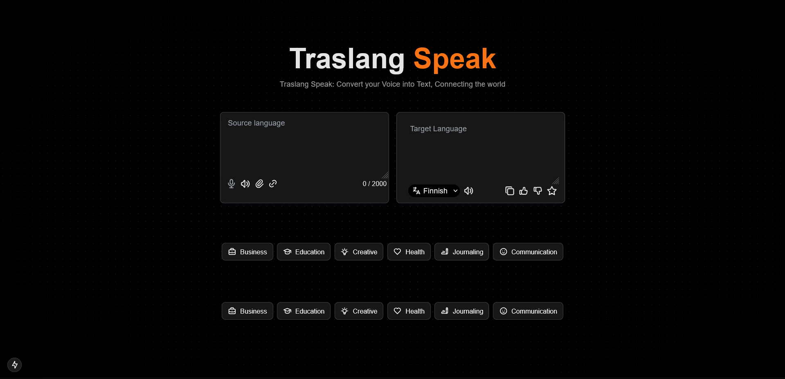

# AI Voice and Text Translator

This repository contains the source code for an AI-powered voice and text translator application built using Next.js, TypeScript, and Google Gemini API.



## Features

- **Voice-to-Text Translation:** Convert spoken words into text using speech recognition.
- **Text Translation:** Translate text into multiple languages powered by AI Gemini.
- **File Upload Support:** Upload text files and process them for translation.
- **Text-to-Speech:** Play audio for translated text.
- **Save Translations:** Save your favorite translations locally.

## Installation

1. Clone the repository:

   ```bash
   git clone https://github.com/lvimuth/voice-and-text-translation.git
   cd voice-text-translator
   ```

2. Install dependencies:

   ```bash
   npm install
   ```

3. Set up your environment variables:

   Create a `.env.local` file in the root directory with the following content:

   ```
   NEXT_PUBLIC_GOOGLE_API_KEY=your-google-api-key
   ```

   Replace `your-google-api-key` with your actual Google Gemini API key.

4. Start the development server:

   ```bash
   npm run dev
   ```

5. Open [http://localhost:3000](http://localhost:3000) in your browser to see the app.

## Project Structure

```
voice-text-translator/
├── pages/
│   ├── index.tsx
│   ├── api/
│
├── components/
│   ├── inputs/
│   │   ├── TextArea.tsx
│   │   ├── FileUpload.tsx
│   │   ├── LinkPaste.tsx
│   │   ├── LanguageSelector.tsx
│   │
│   ├── SpeechRecognition/
│       ├── SpeechRecognition.tsx
│
├── public/
├── styles/
│   ├── globals.css
│
└── package.json
```

## Dependencies

- [Next.js](https://nextjs.org/)
- [TypeScript](https://www.typescriptlang.org/)
- [Google Gemini API](https://developers.google.com/)
- [React Speech Recognition](https://www.npmjs.com/package/react-speech-recognition)
- [Tailwind CSS](https://tailwindcss.com/)

## Usage

1. **Translate Voice to Text:**
   Speak into your microphone, and the app will transcribe your speech into text.

2. **Translate Text:**
   Type or paste text into the input box to translate it into the selected language.

3. **Play Translated Audio:**
   Click the speaker icon to hear the translated text.

4. **Save Favorites:**
   Mark translations as favorites to save them locally.

## Deployment

You can deploy this project using platforms like Vercel. Follow these steps:

1. Push the project to a GitHub repository.
2. Log in to [Vercel](https://vercel.com/).
3. Import your repository and set up the environment variables in the Vercel dashboard.
4. Deploy the app.

## Contributing

Contributions are welcome! Feel free to open issues or submit pull requests to improve the application.

## License

This project is licensed under the MIT License. See the [LICENSE](LICENSE) file for details.
